### Hi there, I'm 0xJasmine 👋

<!--
**jsmjsm/jsmjsm** is a ✨ _special_ ✨ repository because its `README.md` (this file) appears on your GitHub profile.

Here are some ideas to get you started:

- 🔭 I’m currently working on ...
- 🌱 I’m currently learning ...
- 👯 I’m looking to collaborate on ...
- 🤔 I’m looking for help with ...
- 💬 Ask me about ...
- 📫 How to reach me: ...
- 😄 Pronouns: ...
- ⚡ Fun fact: ...
-->

<h2 align="center">👋 Hello! I'm 0xJasmine.</h2>

  <a href="https://news.jsmjsm.xyz">
  Newsletter · 
  </a>
  <a href="https://twitter.com/0xon99">
  Twitter
  </a>

